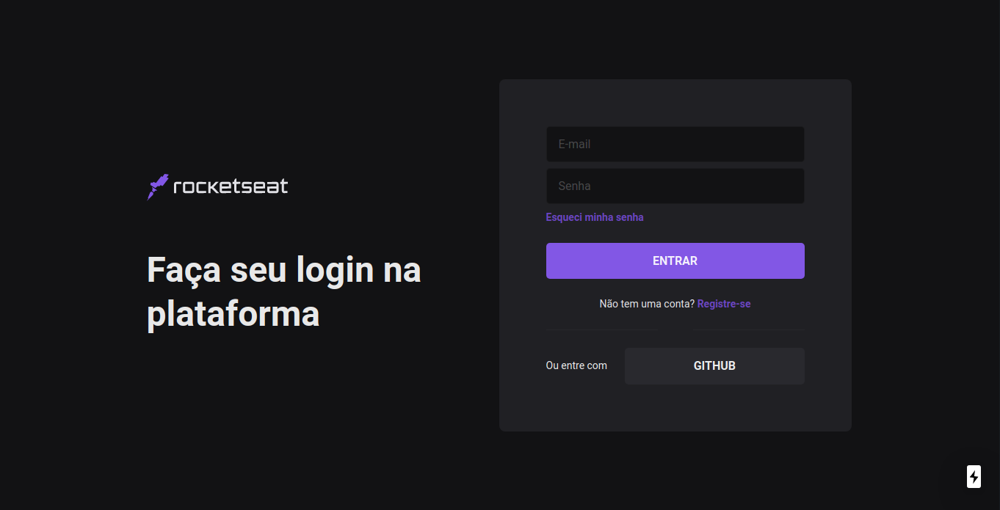

<h1 align="center">
  <p align="center">
    
  </p>
  <h3 align="center">
    Melhor jeito de aprender é praticando.
  </h3>
  </p>
  <p align="center">
      
      
      
      
  </p>
</h1>

<p align="center">
  <a href="#page_with_curl-sobre">Sobre</a>&nbsp;&nbsp;&nbsp;|&nbsp;&nbsp;&nbsp;
  <a href="#books-requisitos">Requisitos</a>&nbsp;&nbsp;&nbsp;|&nbsp;&nbsp;&nbsp;
  <a href="#rocket-começando">Começando</a>&nbsp;&nbsp;&nbsp;|&nbsp;&nbsp;&nbsp;
  <a href="#gear-iniciando-back-end">Node.js</a>&nbsp;&nbsp;&nbsp;|&nbsp;&nbsp;&nbsp;
  <a href="#computer-iniciando-front-end">ReactJS</a>
</p>

## Code/Drops #48 UI declarativas, design system e frameworks

## :page_with_curl: Sobre


Nela o usuário poderá fazer login e com ele acessar uma pagina de "sucesso".

Nesse projeto tive como principal objetivo criar interface de autenticação da Rocketseat com Next.js e Chakra UI utilizando design-system.

**Node.js**: realiza todas as chamadas a API acessando o banco não relacional gerando um ID que retorna para o front-end validando o acesso para pagina de sucesso.

**ReactJS**: é uma página Web no qual o usuário terá acesso a pagina de login e de cadastro.

## :books: Requisitos
- Ter [**Git**](https://git-scm.com/) para clonar o projeto.
- Ter [**Node.js**](https://nodejs.org/en/) instalado.
- Ter [**Yarn**](https://classic.yarnpkg.com/pt-BR/docs/install/) instalado.

## :rocket: 🎧🕹Começando
``` bash
  # Clonar o projeto:
  $ git clone https://github.com/Gilles30/skylabnext-codedrops-48

  # Entrar no diretório:
  $ cd skylabnext-codedrops-48
  
```
### Referências

[Aplicações React do futuro? UI declarativas, design system e frameworks | Code/Drops #48](https://www.youtube.com/watch?v=6TEo2AxW-oQ)

## :gear: Iniciando back-end
🚧***EM CONSTRUÇÃO ***🚧
```bash
  # Entrar no diretório do back-end:
  $ cd backend

  # Instalar as dependências:
  $ yarn

  # Rodar a aplicação:
  $ yarn dev:server
```

## :computer: Iniciando front-end
```bash
  # Entrar no diretório do front-end:
  $ cd frontend

  # Instalar as dependências:
  $ yarn

  # Rodar a aplicação:
  $ yarn dev
```

Feito com 💜 por [Lorison Gilles](https://github.com/Gilles30) 🖖🏻👾☕

### Resultado


